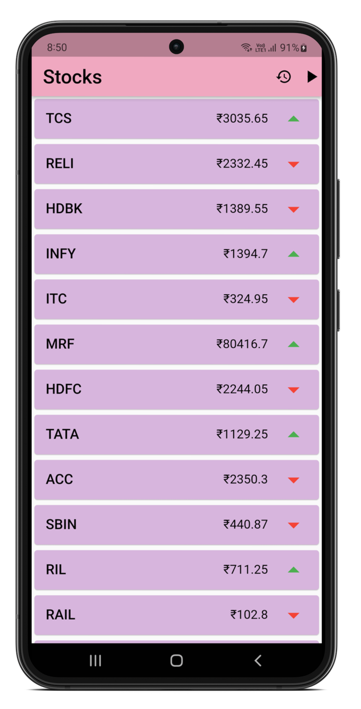
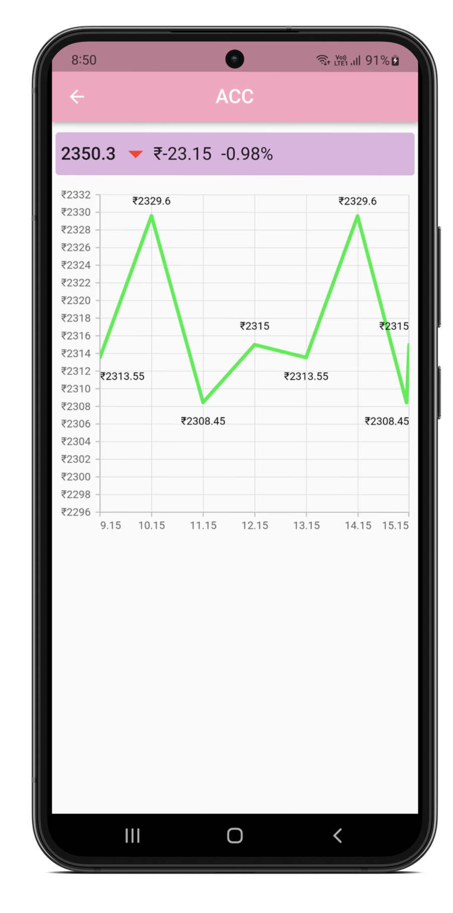

# Price_Tracker

**Description**: An mobile application for the real time tracking of stock prices. The main features of the app is the ability to track and record prices of stock and visualize the data.

  - **Technology stack**: Flutter, Dart 

**Screenshot**

<a> <a >

 
  

## Dependencies

| [Flutter](https://docs.flutter.dev/get-started/install) | [Dart](https://dart.dev/get-dart) | [Syncfusion_flutter_charts](https://pub.dev/packages/syncfusion_flutter_charts) | [VelocityX](https://pub.dev/packages/velocity_x) | [http](https://pub.dev/packages/http) |

## Installation

1.	Clone the repository to your computer
2.	Open the cloned folder in your editor (Vs code preferred) 
3.	Open terminal in editor and write “ flutter pub get” //this will get all the dependencies listed in the pubspec. yaml file in the current working directory, as well as their transitive dependencies.
4.	Run your code by pressing “F5”, or go to run -> start debugging 

## Known issues

1.	Currently the app tracks only 16 stocks.
2.	Play and pause button doesn’t not manipulate the api call.
3.	History page chart is a made with dummy data.

## Getting help

If you have questions, concerns, bug reports, etc, please file an issue in this repository's Issue Tracker

## Credits and references
1.	YouTube channels - 
a.	Syncfusion 
b.	CodePur
c.	Proto Coders Point
2.	Flutter.dev
3.	StackOverflow.com
